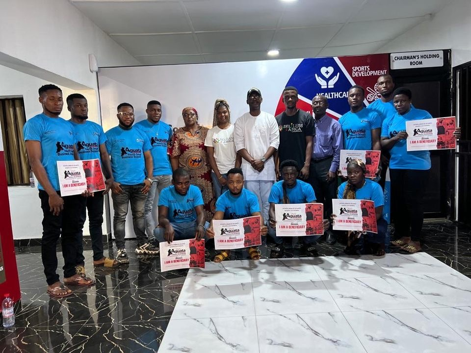

[Aguata Union of Atlanta](https://aguataunion.com/) is the diaspora branch for indigenes of Aguata Local Government area of Anambra State of Nigeria, residing in the state of Georgia. Formed in 2008, we are dedicated to advancing the community welfare of Aguata indigenes in Georgia as well as encouraging the development of our cultural and social heritage of Aguata Indigenes in Nigeria.

Aguata Local Government Area (LGA) is made up of fourteen communities; Achina, Aguluezechukwu, Akpo, Amesi, Ekwulobia, Ezinifite, Igbo Ukwu, Ikenga, Isuofia, Nkpologwu, Ora-Eri, Uga, Umuchu and Umuona. A key contributor to the insecurities afflicting many of our towns is massive poverty and youth unemployment. In 2023, the youth members (ages 21 to 30) of our diasporic community piloted a program to empower youths back in Aguata with a minimum of a high school certificate and no more than 30 years of age, who are indigents and/or reside in Aguata. The program was accomplished in collaboration with the Aguata LGA. Aguata Union of Atlanta funded a minimum of 11 youth across each of the 14 towns in Aguata LGA. Beneficiaries were selected based on proposals they submitted detailing their plans for the funds. We supported individuals in their efforts to pursue a life-sustaining venture detailed in their proposals. This program was an effort to alleviate poverty through empowerment schemes that allow the disenfranchised to pursue a vocation, trade, farming, or other entrepreneurial life-sustaining venture.

