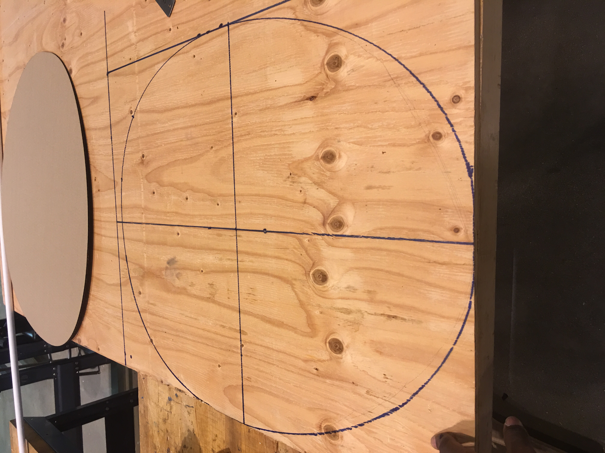
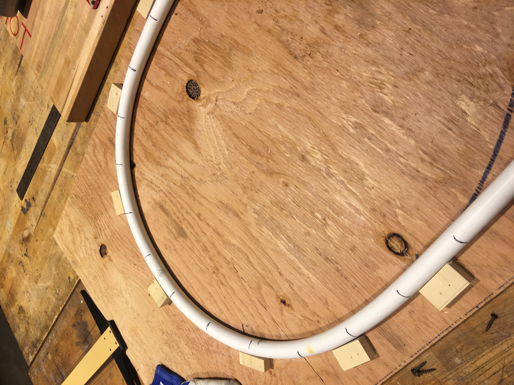

<!-- Main -->

<!-- One -->
<section id="one">
	

<header class="major">
			<h1>The Baby Nest</h1>
		</header>

	
The project described here is from my Design, Thinking and Communication course for my BS in Biomedical Engineering. Our team of 4 included myself, Calypso McDonnell, Sebastian Gomez-Parra, Priyanka Mathur.

The team’s main objective was to design an engaging entertainment unit for children from two months to two years. The device also needed to significantly reduce current infant injury rates and developmental
risks. We delivered a low-fidelity prototype called The Baby Nest to serve as a proof of concept for our design

The Baby Nest is a baby entertainer that spins and bounces to excite
babies. It has a safe egg-shaped enclosure on an extended star-shaped base that reduces risks of
falls and improper seating positioning. It also features an attachable tray to add
multifunctionality as a feeding station and a detachable chair that lends to easier cleaning.

<h4>Skills Utilized</h4>

		<ul>
			<li>Thermoforming</li>
			<li>Low-fidelity prototyping</li>
			<li>CNC Routing</li>
		</ul>

<!--center><iframe src="assets/pdfs/ME310_poster.pdf" width="100%" height="800px"></iframe></center-->

<!--span class="image fit"></span-->
<!--h3>The Team</h3-->
<!--div class="row">
	

		<h4>Stanford University</h4>
		<ul>
			<li>Dolor etiam magna etiam.</li>
			<li>Sagittis lorem eleifend.</li>
			<li>Felis dolore viverra.</li>
		</ul>
	

	

		<h4>Blekinge Institute of Technology</h4>
		<ol>
			<li>Hedvig Ernst</li>
			<li>Karl-Henrik Anderson</li>
			<li>Ludwig Neuman</li>
			<li>Dolor etiam magna etiam.</li>
			<li>Etiam vel lorem sed viverra.</li>
			<li>Felis dolore viverra.</li>
		</ol>
	
 
</div-->

<!--div class="center">
	

		

		

		

	

</div-->
<!--div class="box alt">
	

		

		

		

	

</div-->
 

The full report can be found at the links below 
<a href="https://drive.google.com/file/d/19Nu3eaCBevq2Ewa9fdCxUFhK8Ml5y1X9/view?usp=sharing">Full Report</a> 
 
</section>

