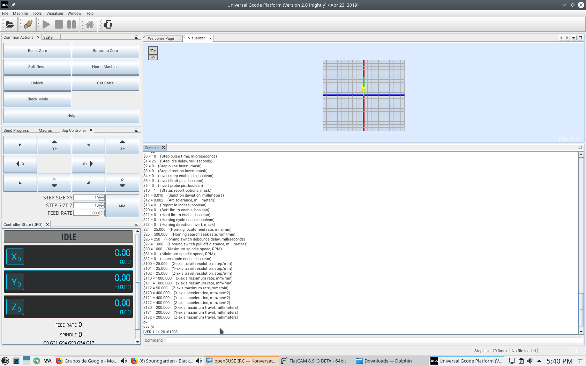

<!-- Main -->

<!-- One -->
<section id="one">
	

The project described here is from my senior design capstone course for my BS in Biomedical Engineering. Our team of 4 included myself, Selam Getaneh, William Zeng, Kevin Zhang.

The team’s main objective was to develop a pipetting robot capable of executing sample pooling so the end user can monitor antiretroviral therapy (ART) success in patients with HIV. Our team was continuing work from a prior year's team.

<h4>Key Accomplishments</h4>

	

		<ul>
			<li>Re-designed sample input rack</li>
			<li>Implemented an open source GRBL controller to command the 3-axis motion of the pipette as well as the sample input rack rotation</li>
			<li>Added barcode scanning and sample tracking capability</li>
			<li>Designed and integrated optical limit switch for precise transition between unit samples</li>
			<li>Completed the assembly of the outer frame of the device</li>
		</ul>
	



<!--center><iframe src="assets/pdfs/ME310_poster.pdf" width="100%" height="800px"></iframe></center-->

<!--span class="image fit"></span-->
<!--h3>The Team</h3-->
<!--div class="row">
	

		<h4>Stanford University</h4>
		<ul>
			<li>Dolor etiam magna etiam.</li>
			<li>Sagittis lorem eleifend.</li>
			<li>Felis dolore viverra.</li>
		</ul>
	

	

		<h4>Blekinge Institute of Technology</h4>
		<ol>
			<li>Hedvig Ernst</li>
			<li>Karl-Henrik Anderson</li>
			<li>Ludwig Neuman</li>
			<li>Dolor etiam magna etiam.</li>
			<li>Etiam vel lorem sed viverra.</li>
			<li>Felis dolore viverra.</li>
		</ol>
	
 
</div-->

<!--div class="center">
	

		

		

		

	

</div-->
<!--div class="box alt">
	

		

		

		

	

</div-->
 

The full report and presentation can be found at the links below 
<a href="https://docs.google.com/document/d/1Q8AthEKy6yZsShGC5UhekRF4tCiFt66pdQCYF49ZAA0/edit?usp=sharing">Full Report</a> 
<a href="https://docs.google.com/presentation/d/1rKeeVvUc_UvYTgSGl-qkQ1HlS2hPmJRj/edit?usp=sharing&ouid=116328992996902971320&rtpof=true&sd=true">Presentation</a>
 

</section>

