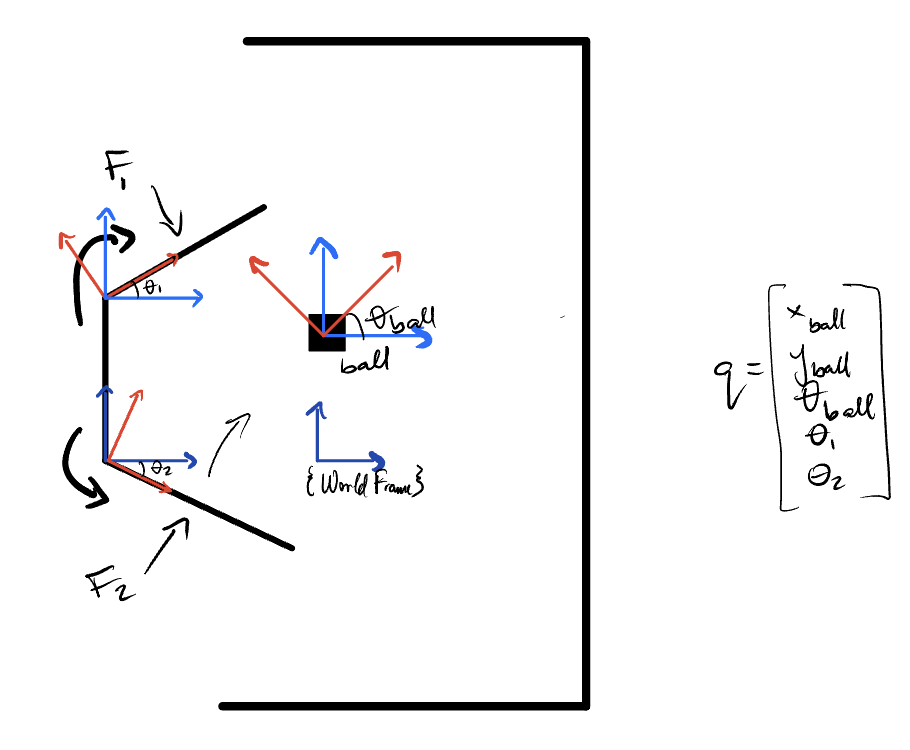

<!-- Main -->

<!-- One -->
<section id="one">
	<header class="major">
			<h1>Machine Dynamics Project</h1>
		</header>



As part of the Machine Dynamics Course at Northwestern University, I wrote code that used Lagrangian dynamics to simulate two swinging arms bouncing a ball off a stationary wall. I then animated the simulation by plotting the calculated location of each rigid body at each timestep.
 
* Note: An applied torque is programmed into the swinging arms so that they never stop moving and can apply a force capable of significantly altering the trajectory of the ball upon impact

<h4>Skills Utilized</h4>
		<ul>
			<li>Lagrangian Dynamics</li>
			<li>Python</li>
		</ul>

<!--center><iframe src="assets/pdfs/ME310_poster.pdf" width="100%" height="800px"></iframe></center-->

<!--h3>The Team</h3-->
<!--div class="row">
	

		<h4>Stanford University</h4>
		<ul>
			<li>Dolor etiam magna etiam.</li>
			<li>Sagittis lorem eleifend.</li>
			<li>Felis dolore viverra.</li>
		</ul>
	

	

		<h4>Blekinge Institute of Technology</h4>
		<ol>
			<li>Hedvig Ernst</li>
			<li>Karl-Henrik Anderson</li>
			<li>Ludwig Neuman</li>
			<li>Dolor etiam magna etiam.</li>
			<li>Etiam vel lorem sed viverra.</li>
			<li>Felis dolore viverra.</li>
		</ol>
	
 
</div-->

<!--div class="center">
	

		

		

		

	

</div-->
<!--div class="box alt">
	

		

		

		

	

</div-->

<!-- Content -->

The source code for the project can be found at the link below 
<a href="https://drive.google.com/file/d/16L9Gz6FiPST4l12DOm1DM2Wn3yszVPyo/view?usp=sharing">Source Code</a> 

</section>

