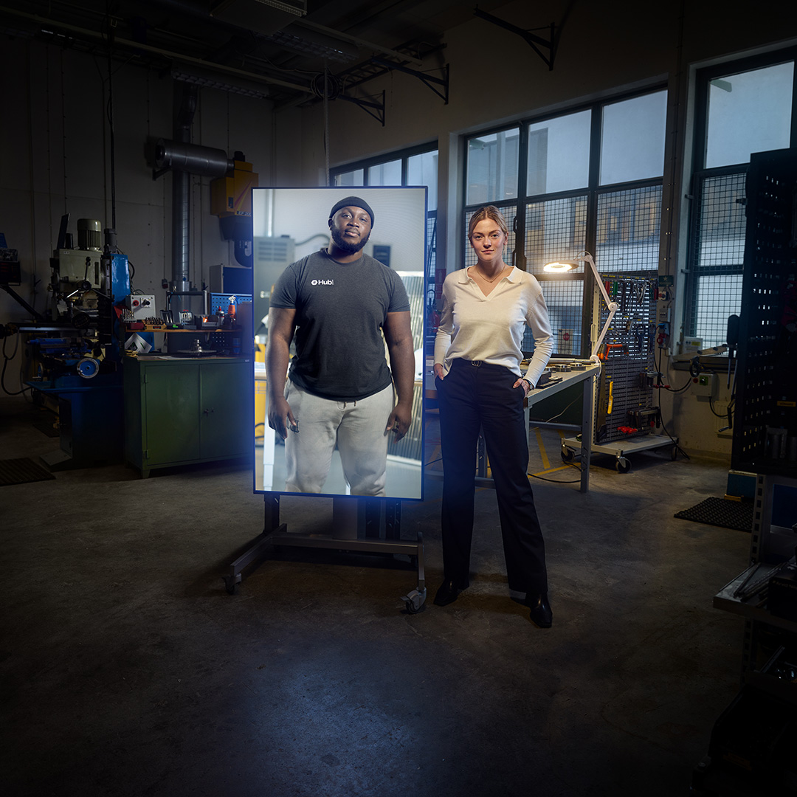
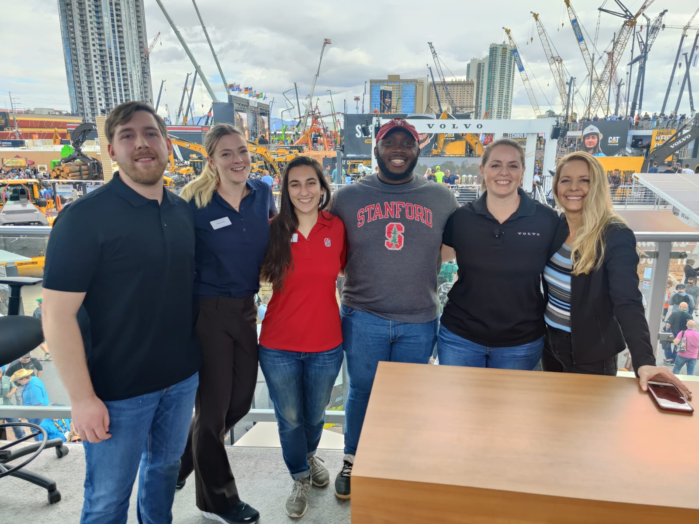
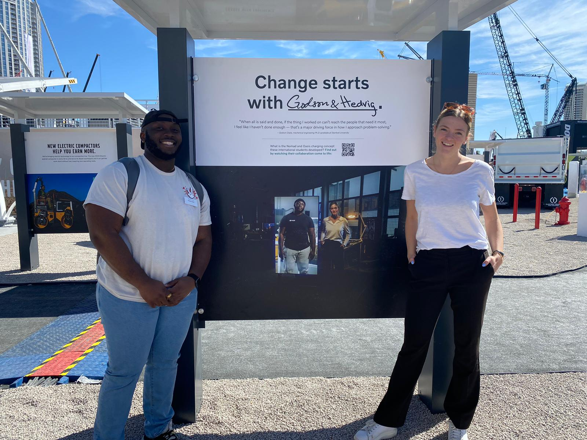

<!-- Main -->

	

<!-- 2024 -->
<section id="three">
	

		<header class="major">
			<h2>2024</h2>
		</header>
		<!-- <h4>Alternate</h4> -->
		<ul class="alt">
			<li> January -  I have accepted an internship offer from Auris Health Inc, a Johnson & Johnson company, to work as an R&D Sensor Systems intern</a>.
			</li>
			<li> January - I got an opportunity to present some of my work at the <a href="https://wearable.su.domains/ewear-annual-meeting-symposium-2024/">2024 Stanford eWear Conference</a>   
 </a>.
			</li>
			<li> January -  My conference paper with my co-first author, <a href="https://kentarobarhydt.mit.edu/">Kentaro Barhydt</a> on a Tip-Clutching Winch for soft growing robots was accepted to the IEEE International Conference on Robotics and Automation (ICRA).</a>
			</li>
		</ul>
	

</section>

<!-- 2023 -->
<section id="three">
	

		<header class="major">
			<h2>2023</h2>
		</header>
		<!-- <h4>Alternate</h4> -->
		<ul class="alt">
			<li> August - I recently accepted a role as a Graduate Scholar in Residence at the Stanford University Black Community Services Center! In this role, I get the opportunity to support members of the Stanford graduate community who identify as Black.
			</li>
			<li> August - The Stanford Robotics Center Summer Research Program, which I co-founded and ran as part of my work as a RAISE Fellow recently wrapped up. Learn more about the program <a href="raise.html">here</a>.
			</li>
			<li> May - The Aguata Youth Empowerment Program, which I executed and raised funds for as part of my role as Youth Coordinator for Aguata Union of Atlanta diasporic community recently wrapped up. Learn more about the work <a href="aguata.html">here</a>.
			</li>
			<li> April - I was one of the recipients of the <a href="https://alumni.stanford.edu/students/grad/graduate-awards/">2023 Stanford Community Impact Award!</a>
			</li>
			<li> March - Volvo CE decided to highlight our <a href="me310.html">ME310 project</a> as part of their "Change Starts Here" campaign which highlights the innovative ways that ECVs can contribute to environmentally sustainable practices in the construction and agricultural industry. I, along with 3 other teamates, presented the work as part of Volvo CE's exhibit at the 2023 CONEXPO-CON/AGG construction. The project was also featured on the <a href="https://www.volvoce.com/united-states/en-us/about-us/change-starts-here/godson-hedvig-story/">Volvo CE Website</a>. Watch the campaign <a href="https://youtu.be/Z2QeHvUqjK0?si=DfltvojqERmTjKNx">here</a>.
			

			
			
			
			

			</li>
		</ul>
	

</section>

<!-- 2022 -->
<section id="one">
	

		<header class="major">
			<h2>2022</h2>
		</header>
		<!-- <h4>Alternate</h4> -->
		<ul class="alt">
			<li> December - My work with my labmate, <a href="http://stanford.edu/~brianhdo/) ">Brian Do</a> on a Robotic Manipulator designed out of tape measures was featured again in Stanford eWear's <a href="https://mailchi.mp/6c13b7880a85/ewear-newsletter-december-120522">December Newsletter</a> </li>
			<li>November - My work with my labmate, <a href="http://stanford.edu/~brianhdo/) ">Brian Do</a> on a Robotic Manipulator designed out of tape measures was featured on the Institute of Electrical and Electronics Engineers' (IEEE) <a href="https://spectrum.ieee.org/video-friday-turkey-sandwich">Video Friday</a></li>
			<li> November - I got an opportunity to present some of my work at the <a href="https://systemx.stanford.edu/events/annual-conference/20221115/systemx-2022-fall-conference-nov-15-17-2022">SystemX Robotics Fall Conference</a>   

  
			</li>
			<li> October - I passed my candidacy qualifying exams! Officially a PhD candidate!
			</li>
			<li> May - I received the <a href="https://vpge.stanford.edu/fellowships-funding/RAISE/details">2022-2023 RAISE (Research, Action, and Impact through Strategic Engagement) Doctoral Fellowship!</a>
			</li>
			<li> May - My co-author and I presented our conference paper at the 2022 IEEE International Conference on Robotics and Automation (ICRA) in Philadelphia, PA.     

  
			</li>
			<li> March - I received the <a href="https://sites.nationalacademies.org/PGA/FordFellowships/index.htm">Ford Foundation Predoctoral Fellowship!</a>
			</li>
			<li> February - I received the <a href="https://mailchi.mp/stanford/systemx-newsletter-february-2022">SystemX Robotics DEI Fellowship!</a>
			</li>
			<li> February - My work creating a mixed reality tool to aid individuals with limited mobility was featured in a Wu Tsai Neurosciences Institute <a href="https://neuroscience.stanford.edu/news/medical-mixed-reality-applications-take-center-stage-open-house-event?utm_source=Stanford+ALL&utm_campaign=cd2504742a-int_COPY_01&utm_medium=email&utm_term=0_c042b4aad7-cd2504742a-54965234">article</a> about medical mixed reality applications based on their projects for a Stanford course. You can see a video about the project <a href="http://youtu.be/D6Vt6CaK1L4?t=1730">here</a>    

  
			</li>
			<li> January - My conference paper with my labmate, <a href="http://stanford.edu/~brianhdo/) ">Brian Do</a> on a Robotic Manipulator designed out of tape measures was accepted to the IEEE International Conference on Robotics and Automation (ICRA). This is my first published paper! <a href="https://ieeexplore.ieee.org/abstract/document/9811976">Link to Paper</a>. </li>
		</ul>
	

</section>
<!-- 2021 -->
<section id="three">
	

		<header class="major">
			<h2>2021</h2>
		</header>
		<ul class="alt">
			<li> June - I was featured in a Northwestern News <a href = "https://news.northwestern.edu/stories/2021/06/fgli-graduation-celebration/">article</a> highlighting the contributions of FGLI students to the campus and the inaugural FGLI Graduation Celebration!
			</li>
			<li> June - I received the <a href = "https://www.mccormick.northwestern.edu/students/undergraduate/student-prizes-awards.html#seniors">McCormick School Alumni Award</a>!
			</li>
			<li> April - I recently decided to accept my offer to participate in the Stanford University <a href = "https://engineering.stanford.edu/students-academics/equity-and-inclusion-initiatives/graduate-programs/summer-opportunities">Summer First Program</a> starting this June!</li>
			<li> April - I recently decided to accept my Mechanical Engineering PhD offer from Stanford University!
			</li>
			<li> January - The Daily Northwestern featured a story on <a href = "https://dailynorthwestern.com/2020/01/20/campus/alpha-mu-hosts-annual-martin-luther-king-jr-candlelight-vigil/">the annual candlelight vigil on Martin Luther King Jr. Day</a> I help organize as part of my role as Vice President of the Alpha Mu Chapter of Alpha Phi Alpha Fraternity Inc.
			</li>
			<li> January - I got the opportunity to participate in the <a href = "https://diversity.gatech.edu/students/office-minority-educational-development/omed-student-programs/focus-prospective-grad-students/focus-overview">Georgia Tech FOCUS Program!</a>
			</li>
		</ul>
	

</section>

<!-- 2020 -->
<section id="three">
	

		<header class="major">
			<h2>2020</h2>
		</header>
		<ul class="alt">
			<li> October - I got the opportunity to participate in the <a href = "https://engineering.stanford.edu/students-academics/equity-and-inclusion-initiatives/prospective-graduate-programs/stanford-exposure">Stanford Exposure to Research and Graduate Education (SERGE) Program!</a>
			</li>
			<li> May - I received the <a href="https://www.mccormick.northwestern.edu/biomedical/news-events/news/articles/2020/2020-student-awards.html">Lyle F. Mockros Outstanding Student Award!</a>
			</li>
			<li> February - I  got a chance to perform during a Chicago Bulls Halftime Show as a representative of Alpha Phi Alpha Fraternity Inc in honor of Black History Month! You can watch the performance <a href="https://www.youtube.com/watch?v=Obi-ZN2HH8k">here</a>.
			</li>
			<li> January - The Daily Northwestern featured a story on <a href = "https://dailynorthwestern.com/2020/01/20/campus/alpha-mu-hosts-annual-martin-luther-king-jr-candlelight-vigil/">the annual candlelight vigil on Martin Luther King Jr. Day</a> I help organize as part of my role as Vice President of the Alpha Mu Chapter of Alpha Phi Alpha Fraternity Inc.
			</li>
		</ul>
	

</section>

