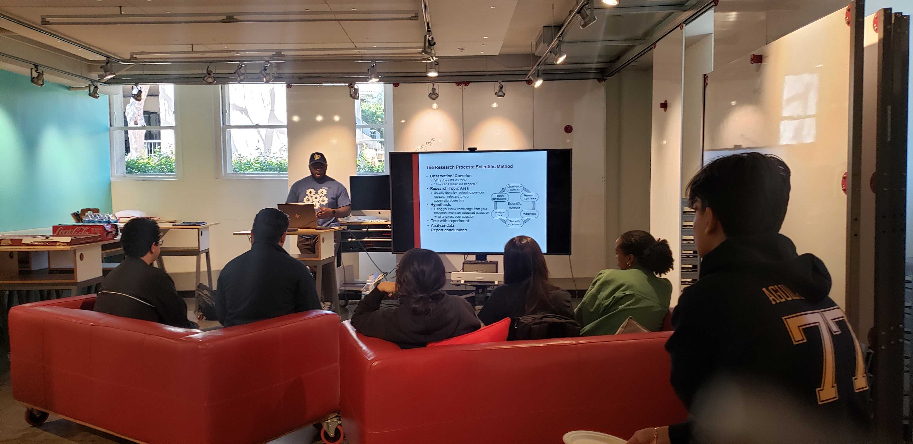
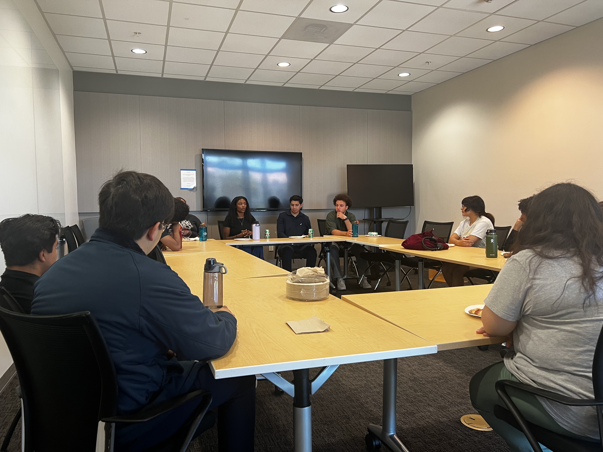
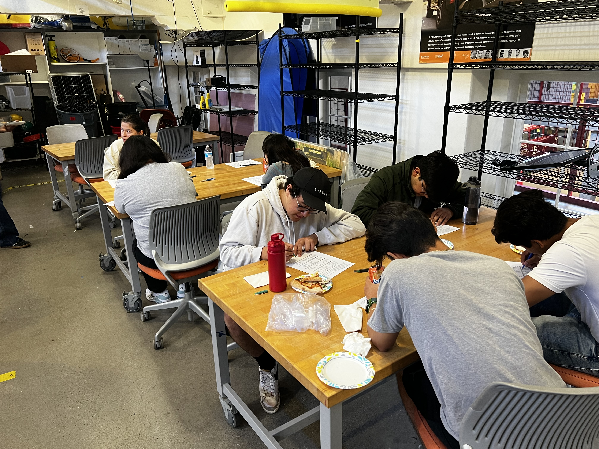

Stanford Robotics Center Summer Research Program (SRC SRP) was a 6 week paid research internship for high school students aged 16 or older interested in Robotics/Engineering. The internship targets first generation, low income, and racially minoritized students with the goal of providing real-world experiences in science and engineering research. Students were assigned research projects in labs associated with the Stanford Robotics Center, paired with a lab mentor to help guide them, and given demos on different projects in the lab. They were also given the opportunity to present their work/learnings at a poster session at the end of the program. I handled every aspect of the program: Fundraising ($26,000), Partnerships with schools and nonprofit organizations, Educational content, Mentor recruitment and training, Student wellness, Program administration and communications.

During the program, students:
<ul>
    <li>Performed engineering research at a university</li>
    <li>Gained college readiness skills</li>
    <li>Learned design thinking processes</li>
    <li>Learned technical skills associated with the lab research and how to use special equipment and tools in the lab</li>
    <li>Interacted and learned from world-class researchers</li>
</ul>

Projects Students Worked on in their assigned labs (Final presentations can be viewed [here](https://drive.google.com/drive/folders/1Uz9iELMA8ZZdnH7h0OoK92mzWm0Smdby?usp=sharing)):

- Design and Fabrication of [Vine Robots](https://www.vinerobots.org/) and Novel Mechanisms for Distal Fixture Attachment
- Characterizing Kirigami Stretchable Sensors
- Modifying Fused Deposition Modeling 3D printers for improved performance
- Assessing the Image Processing Effectiveness of Different Machine Learning Models
- Designing Tactile Attachments for a Wearable Haptics Device
- Implementation of a PID Controller on a Dublin's 2D Car Model
- Setting Up Protective Zones for Robot Arm
- Investigating Applications of Magnetorheological Fluids to Robotic Manipulator Design
- Comparing Different Methods of Teleoperation for Robotic Arms

Program Workshops:

- [Research 101](https://docs.google.com/presentation/d/1ITh-bwnnhH4YCF3n4rOrMCGfXyDrbunt/edit?usp=sharing&ouid=108608349859931358046&rtpof=true&sd=true)
  - A review of what research looks like at academic institutions
    - Administered by: Godson Osele, Mechanical Engineering PhD Candidate at Stanford University

- Undergraduate Student Panel
  - Panel consisted of First-Generation and/or Low-Income students attending(studying)
    - Howard University, (Chemical Engineering)
    - San Francisco State University, (Mechanical Engineering)
    - University of California-Los Angeles, (Mechanical Engineering)
    - University of Colorado-Denver, (Mechanical Engineering)
    - Stanford University, (Mechanical Engineering)

- Industry Panel
  - Panel consisted of First-Generation and/or Low-Income individuals with current or previous positions at the following companies
    - Intuitive Surgical
    - Auris, a J&J Company
    - GoogleX
    - Jet Propulsion Laboratories
    - GE Healthcare

- Research Flash Talks
  - Current Stanford Graduate Students presented 10 minute talks on their research. Topics are listed below
    - Bi-Manual Manipulation
    - Path planning for robots on Mars
    - Combining LiDAR, vision and GNSS sensors for Global Positioning

- Design Thinking Fundamentals
  - Stanford Mechanical Engineering Professor, Mark Cutkosky, delivered a workshop going over the basics of Design Thinking as taught by the Design School at Stanford University
- Graduate Student Panel
  - Panel consisted of First-Generation and/or Low-Income Stanford PhD students attending(studying)
    - Chemical Engineering
    - Mechanical Engineering
    - Environmental Engineering
    - Management Sciences and Engineering

Aggregate of Skills Learned Across All The Students:

- CAD Modeling (Fusion 360, SolidWorks, OnShape)
- Utilizing 3D Printers
- Utilizing Laser Cutter
- Reading through research papers effectively
- How Soft robotic structures function
- How Magnetorheological fluids function
- Motion Capture
- Dynamic Modeling
- Application of Origami to Robotics
- Designing Soft Robots
- Soldering
- Ultrasonic welding
- Machine Learning
- Creating Graphical User Interfaces
- Experiment Design
- Strategies for Navigating Academia