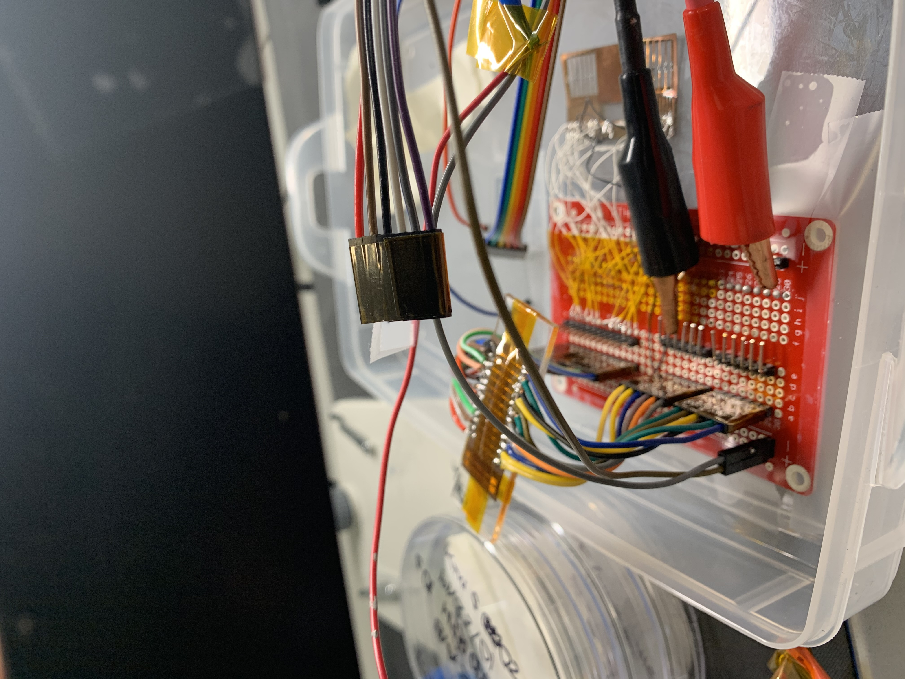
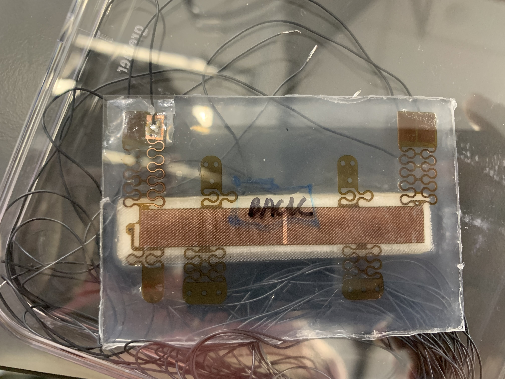
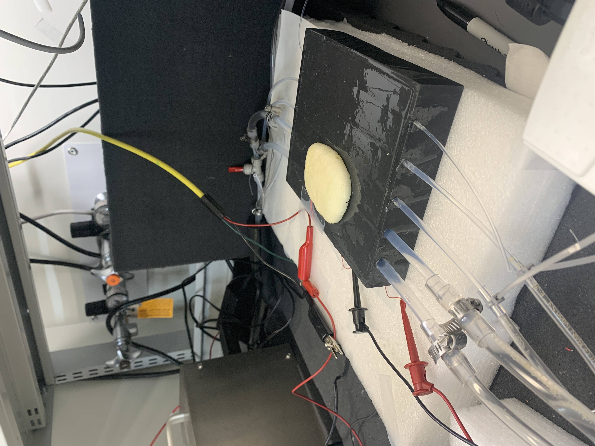
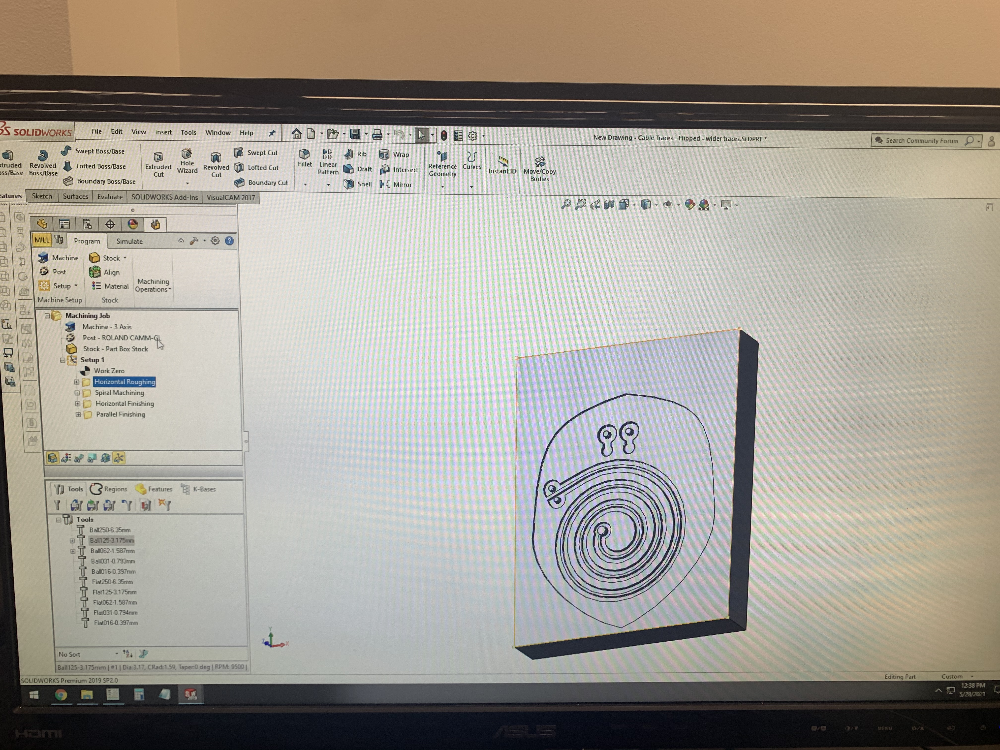

<!-- Main -->

<!-- One -->
<section id="one">

<header class="major">
			<h1>Variable Flow Sensing with Thermal Anisotropy</h1>
		</header>

During my time at Northwestern, I worked as an undergraduate research assistant in 
Rogers Research Group directed by Professor John A. Rogers under the supervision of Professor Andrea Carlini (then Post-doc). I gained hands-on experience fabricating current 
carrying elastomers and microelectronic devices that exploit soft materials for medical solutions. One of these devices is a wireless flow sensing device that estimates blood flow rate underneath the skin by analyzing the skin’s anisotropic properties. For testing within this project, I designed phantom skins resembling the epidermis utilizing Solidworks and a silicone elastomer with conductivity comparable to the human skin. Constructing the microelectronic flow sensing device, I used negative temperature coefficient thermistors that are upstream and downstream of a thermal actuator applying heat to the phantom skin to track change in resistance. In an effort to make data collection easier, I established a streamlined data acquisition system to perform multiple tests by assembling a circuit board utilizing a voltage divider and digital multimeter to track all sensor resistances simultaneously over time in LabView. More details are in the reports below

<iframe src="assets/pdfs/Variable Flow Sensing with Thermal Anisotropy.pdf" width="100%" height="800px"></iframe>

<iframe src="assets/pdfs/Variable Flow Sensing Project.pdf" width="100%" height="800px"></iframe>

Additionally, I got a chance to briefly contribute to another project surrounding Soft, Skin-Interfaced Microfluidic Systems. With that project, I fabricated molds for microfluidic devices using a CNC mill and then mixed and cured the silicone elastomers in the molds. Lastly, I embedded carbon traces in the devices to act as an electrical conduit.

Here are pictures of the molds

</section>

